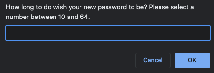
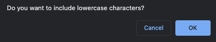
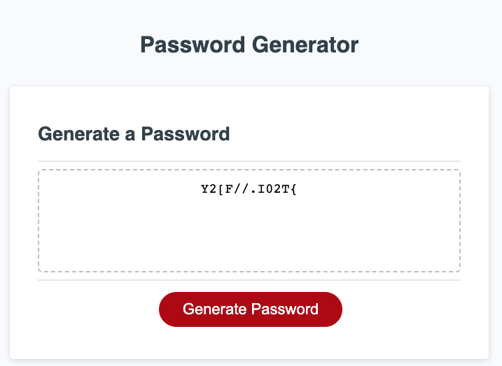

# Bootcamp Module 5 Challenge: Password Generator

## Description

The goal of this challenge was to use JavaScript to create a functional password generator.

Students were provided with starter code, which they could either keep/follow or modify, as long as the final result respects the rules/constraints in the next section, "Tasks".

## Tasks

When the "Generate Password" button is clicked, a password must be generated.

 

 

Password is only considered valid if the below conditions are observed.

- Has a certain length:
  - At least 10 characters but no more than 64.
- At least one character type is selected:
  - Lowercase
  - Uppercase
  - Numeric
  - Special Characters

User should should be prompted to enter their desired password length:

 

 

User should be able to confirm which password options (type of characters) they wish to consider/discard, such as:

 

 

Once these have been captured and validated for correctness, a random password should be displayed on the page:

 

 

## GitHub Pages

Deployed version of this project can be seen [here](https://vcdsc.github.io/password-generator/starter/index.html).

## License

Please refer to the LICENSE in the repo.
